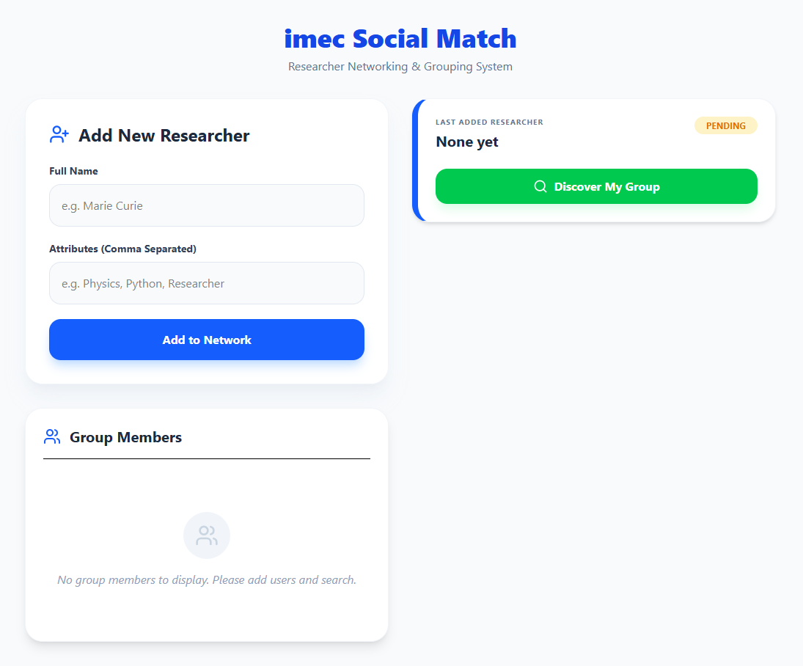

# ResearchConnect: AI-Powered Researcher Matching System

ResearchConnect is a high-performance, containerized web application designed to foster collaboration among **imec** researchers. It utilizes an asynchronous matching engine to group researchers based on shared technical expertise and interests.

## Key Features

1. **Automated Smart Grouping:** Automatically clusters researchers into collaborative groups using a "minimum 3-shared attributes" matching logic.
2. **Asynchronous Execution:** Leverages Python's `BackgroundTasks` to ensure matching computations don't block the user interface.
3. **Portable & Scalable:** Fully containerized with **Docker**, allowing for "one-command" deployment in any environment.
4. **Type-Safe Frontend:** Built with **TypeScript** to ensure robust data handling and a bug-free UI experience.
5. **Responsive Design:** A sleek, modern interface optimized for all devices using **Tailwind CSS**.



## Tech Stack

- **Backend:** FastAPI (Python), SQLAlchemy ORM, SQLite.
- **Frontend:** React 18, TypeScript, Vite, Axios, Tailwind CSS.
- **DevOps:** Docker, Docker Compose.

### Prerequisites

Docker & Docker Compose installed on your system.

### Installation & Launch

1. **Clone the repository:**

   ```bash
   git clone [https://github.com/your-username/research-connect.git](https://github.com/your-username/research-connect.git)
   cd research-connect

   ```

2. **Start the system:**

   ```bash
   docker-compose up --build

   ```

3. **Access the Application:**

Frontend Interface: http://localhost:5173

Interactive API Documentation (Swagger): http://localhost:8000/docs

The system follows a strict "privacy-first" and "efficiency-driven" approach:

When a researcher registers with 5 unique attributes, the backend initiates an asynchronous search.

It compares the new user's attributes against existing database records.

If at least 3 attributes match an existing group, the user is assigned to that group.

Otherwise, a new unique group is generated using UUID v4 standards.
